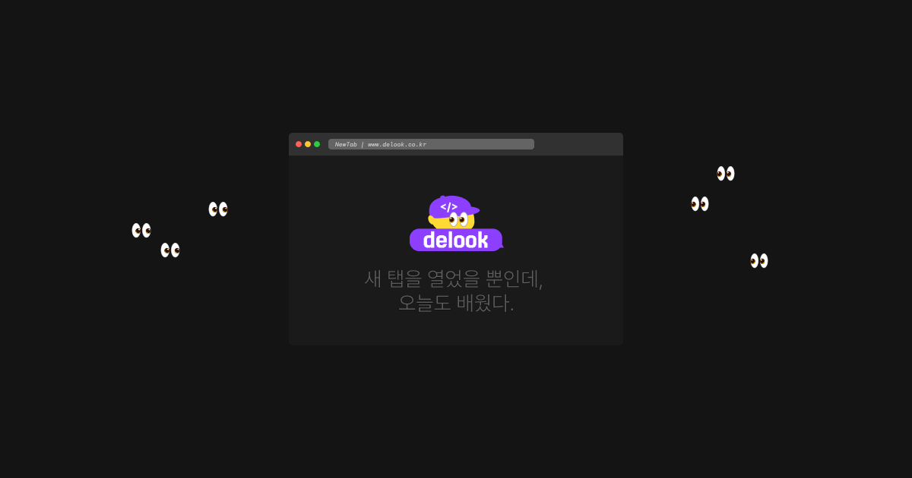

# 디룩 (Delook)

> 성장하는 개발자를 위한 오픈소스 기반 지식 공유 플랫폼

  

  <a href="https://www.delook.co.kr" target="_blank">
    <strong>Delook 바로가기</strong>
  </a>

디룩(Delook)은 브라우저 새 탭에서 프로그래밍 지식을 학습할 수 있도록 돕는 플랫폼입니다.

프로젝트가 마음에 드셨다면 `⭐️ star`로 응원해주세요!

## 기능 소개

- 접속할 때마다 랜덤한 프로그래밍 개념을 학습할 수 있습니다.
- 카테고리나 제목으로 원하는 개념을 쉽게 찾을 수 있습니다.
- 전체 아카이브 또는 북마크를 통해 관심 있는 개념만 모아볼 수 있습니다.
- 개념 설명과 함께 예시를 확인할 수 있어 이해를 도와줍니다.

## 기술 스택

- **Frontend**: React 19, TypeScript, Vite
- **Styling**: Tailwind CSS, shadcn/ui
- **Platform**: Chrome Extension, Web
- **Infra / Deployment**: AWS S3, CloudFront

## 배포 플로우

- `main` 브랜치에 병합 후 `production` 브랜치를 통해 배포가 진행됩니다.
- 웹사이트와 크롬 스토어 배포가 동시에 이루어지며, 크롬 스토어의 경우 심사 기간(약 2일)으로 인해 배포 시점에 차이가 있을 수 있습니다.

## 설치 및 사용법

설치 및 사용법은
<a href="https://github.com/delook-dev#%EC%84%A4%EC%B9%98-%EB%B0%8F-%EC%82%AC%EC%9A%A9%EB%B2%95" target="_blank">
<strong> 여기</strong></a>에서 확인해주세요.

## 기여

> 곧 디룩을 함께 만들어나갈 기여자들을 모집할 계획입니다.   추후 내용이 확정되면 공지를 올리겠습니다.

디룩은 함께 만들어가는 오픈소스 프로젝트입니다.
다음과 같은 기여를 받고 있습니다

- 콘텐츠 기여
- 버그 리포트 및 개선

자세한 기여 방법은 [CONTRIBUTING.md](https://github.com/delook-dev/delook/blob/main/CONTRIBUTING.md)와 [CODE_OF_CONDUCT.md](https://github.com/delook-dev/delook/blob/main/CODE_OF_CONDUCT.md)를 참고해주세요.

기능 제안이나 UI 개선은 [Issues](https://github.com/delook-dev/delook/issues) 또는 [Discussions](https://github.com/delook-dev/delook/discussions)을 통해 남겨주시면 관리자가 검토 후 작업하도록 하겠습니다.
